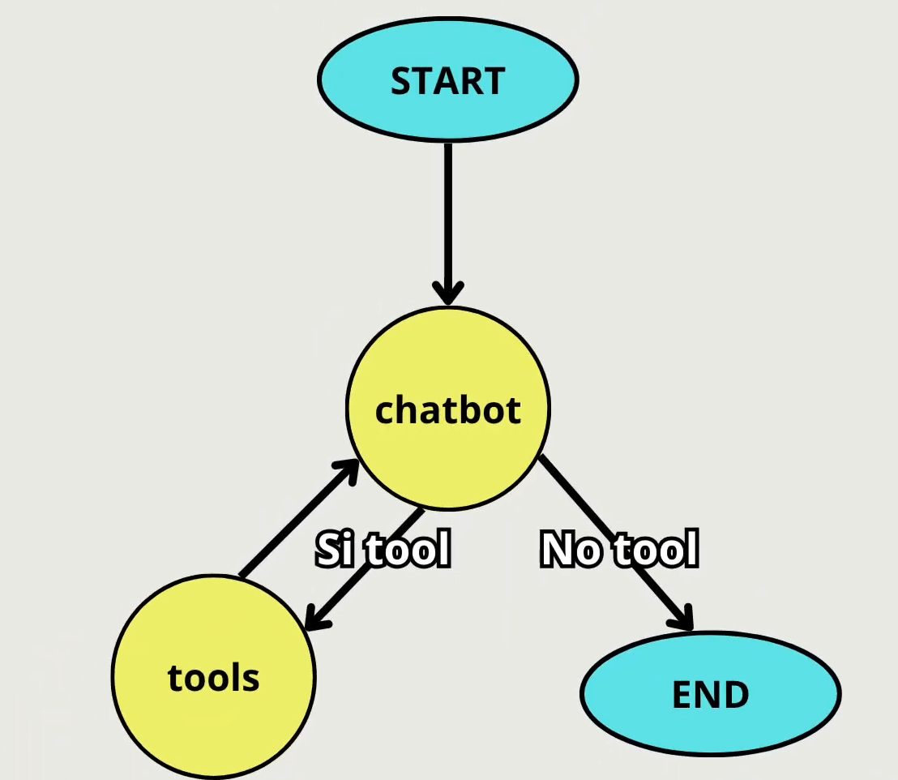

# LangGraph Chatbot Agent

## Descripción General

Este proyecto implementa un agente conversacional inteligente utilizando **LangGraph**, un framework para construir aplicaciones complejas con grafos de estado. El agente combina un modelo de lenguaje (LLM) con capacidades de búsqueda web en tiempo real, permitiendo respuestas informadas y contextualizadas.

## Arquitectura y Estructura

El agente sigue una arquitectura de **grafo de estados** que define el flujo de ejecución mediante nodos y bordes condicionales:

## Flujo del agente:


### Componentes Principales

| Módulo | Responsabilidad |
|--------|-----------------|
| **config.py** | Gestión de configuración: LLM, herramientas, memoria y variables de entorno |
| **state.py** | Define la estructura de estado del grafo (historial de mensajes) |
| **graph.py** | Construcción del grafo: nodos, transiciones y lógica condicional |
| **chat.py** | Interfaz de usuario: loop de chat y streaming de actualizaciones |
| **main.py** | Punto de entrada de la aplicación |

## Flujo de Ejecución

1. **Entrada del usuario**: El usuario ingresa un mensaje en la terminal
2. **Nodo Chatbot**: El LLM procesa el mensaje y el historial, decidiendo si necesita herramientas
3. **Decisión Condicional**:
   - Si el LLM requiere información externa → ejecuta el nodo Tools
   - Si no → retorna respuesta directa
4. **Nodo Tools**: Ejecuta búsquedas web con Tavily (máx. 2 resultados)
5. **Retroalimentación**: El LLM procesa los resultados de las herramientas y genera respuesta final
6. **Persistencia**: Todo el historial se almacena en memoria para contexto futuro

## Componentes Técnicos

### Modelo de Lenguaje
- **Proveedor**: OpenRouter
- **Modelo**: Nvidia Nemotron-3 Super 120B (versión gratuita)
- **Capacidades**: Vinculación automática de herramientas para decisiones inteligentes

### Herramientas Disponibles
- **Tavily Search**: Búsqueda web en tiempo real con resultados relevantes

### Persistencia
- **MemorySaver**: Almacenamiento en memoria de estados del grafo
- **Thread ID**: Identificador de conversación para mantener contexto

## Instalación y Uso

### Requisitos
- Python 3.9+
- Variables de entorno configuradas en `.env`

### Instalación de Dependencias
```bash
pip install -r requirements.txt
```

### Ejecución
```bash
python main.py
```

### Comandos de Salida
- `quit`, `exit`, `salir`, `q` - Terminar la aplicación

## Ejemplo de Uso

```
User: ¿Cuál es el resultado de la final del Mundial 2022?
[El agente usa la herramienta Tavily para buscar información actual]
Assistant: El resultado de la final fue... [respuesta basada en búsqueda web]

User: ¿Quién ganó?
[El agente mantiene contexto del mensaje anterior]
Assistant: Argentina ganó el Mundial 2022... [respuesta contextualizada]

User: exit
Goodbye!
```

## Conceptos Clave de LangGraph

- **StateGraph**: Define la estructura y flujo del grafo
- **Nodes**: Unidades de trabajo que procesan el estado
- **Conditional Edges**: Decisiones que determinan el próximo nodo
- **Checkpointer**: Persistencia de estados entre ejecuciones
- **Stream Mode**: Obtención de actualizaciones en tiempo real

## Notas de Desarrollo

- El sistema mantiene contexto de conversación a través de `MemorySaver`
- Las búsquedas se limitan a 2 resultados para respuestas concisas
- El LLM decide automáticamente cuándo usar herramientas
- Manejo de errores graceful con despedida elegante
