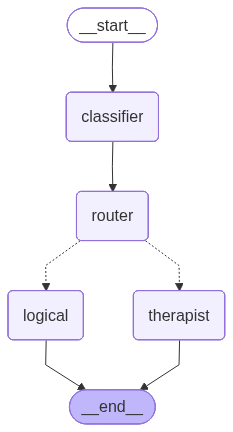

# LangGraph Router Agent

## Descripción General

Este proyecto implementa un **agente inteligente de enrutamiento** que clasifica automáticamente mensajes del usuario y los dirige a especialistas adecuados. Utiliza **LangGraph** para orquestar un flujo condicional donde un clasificador determina si un usuario necesita apoyo emocional (terapeuta) o análisis lógico (asistente lógico).

## Arquitectura y Flujo

El agente implementa un patrón de **routing condicional** donde cada tipo de mensaje es manejado por un especialista diferente:



### Componentes Principales

| Componente | Responsabilidad |
|------------|-----------------|
| **Classifier** | Determina si el mensaje es emocional o lógico usando structured output |
| **Router** | Dirige el mensaje al agente especializado basado en clasificación |
| **Therapist Agent** | Proporciona apoyo emocional con empatía y validación |
| **Logical Agent** | Ofrece análisis factual basado en lógica y evidencia |
| **State** | Gestiona historial de mensajes y tipo de clasificación |

## Componentes Técnicos

### Clasificación Estructurada
- **Pydantic BaseModel**: Define esquema `MessageClassifier` con tipos literales
- **Structured Output**: Garantiza respuestas determinísticas del LLM
- **Tipos**: `emotional` (emocional) o `logical` (lógico)

### Modelo de Lenguaje
- **Proveedor**: OpenRouter
- **Modelo**: Nvidia Nemotron-3 Super 120B (versión gratuita)
- **Capacidades**: Clasificación estructurada y generación de respuestas especializadas

### Gestión de Estado
- **Historial de mensajes**: Almacenado con `add_messages` para concatenación automática
- **Tipo de mensaje**: Clasificación persistente en el estado
- **Context preservation**: Mantiene contexto de conversación entre turnos

## Flujo de Ejecución

1. **Entrada del usuario**: Mensaje ingresado en la terminal
2. **Nodo Classifier**: 
   - Extrae último mensaje del historial
   - LLM con structured output clasifica como "emotional" o "logical"
3. **Nodo Router**: 
   - Lee clasificación
   - Determina siguiente nodo (`therapist` o `logical`)
4. **Agentes Especializados**:
   - **Therapist**: Responde con empatía, validación y preguntas reflexivas
   - **Logical**: Proporciona hechos, análisis claro y respuestas directas
5. **Salida**: Respuesta mostrada en terminal
6. **Persistencia**: Mensaje del asistente agregado al historial

## Casos de Uso

### Mensaje Emocional
```
User: "Me siento muy solo y no sé cómo salir adelante"
[Classifier: emotional]
[Router: therapist]
Assistant: "Siento que te encuentres en esta situación. Es completamente válido 
sentirse solo. ¿Hay algo específico que te esté preocupando más?"
```

### Mensaje Lógico
```
User: "¿Cuál es la capital de Francia?"
[Classifier: logical]
[Router: logical]
Assistant: "La capital de Francia es París. Es la ciudad más grande del país 
y centro político, cultural y económico."
```

## Instalación y Uso

### Requisitos
- Python 3.13
- API key de OpenRouter configurada en `.env`

### Variables de Entorno (.env)
```
OPENROUTER_API_KEY=your_api_key_here
```

### Ejecución
```bash
python main.py
```

### Comandos
- `exit`, `salir`, `q` - Terminar la aplicación

## Conceptos Clave de LangGraph

- **StateGraph**: Define la estructura del grafo de estado
- **Nodes**: Unidades de procesamiento (Classifier, Router, Agents)
- **Conditional Edges**: Decisiones que determinan el flujo (`router` decide siguiente nodo)
- **Structured Output**: Garantiza salidas tipadas del LLM
- **Message Aggregation**: `add_messages` concatena automáticamente mensajes

## Ventajas del Patrón Router

✅ **Especialización**: Cada agente optimizado para su dominio
✅ **Escalabilidad**: Fácil agregar nuevos tipos de agentes
✅ **Precisión**: Clasificación estructurada reduce errores
✅ **Contexto**: Historial compartido entre todos los nodos
✅ **Mantenibilidad**: Prompts de sistema separados por especialidad